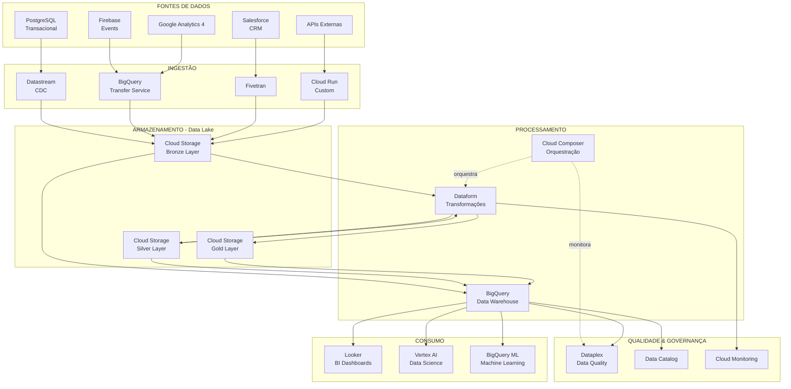
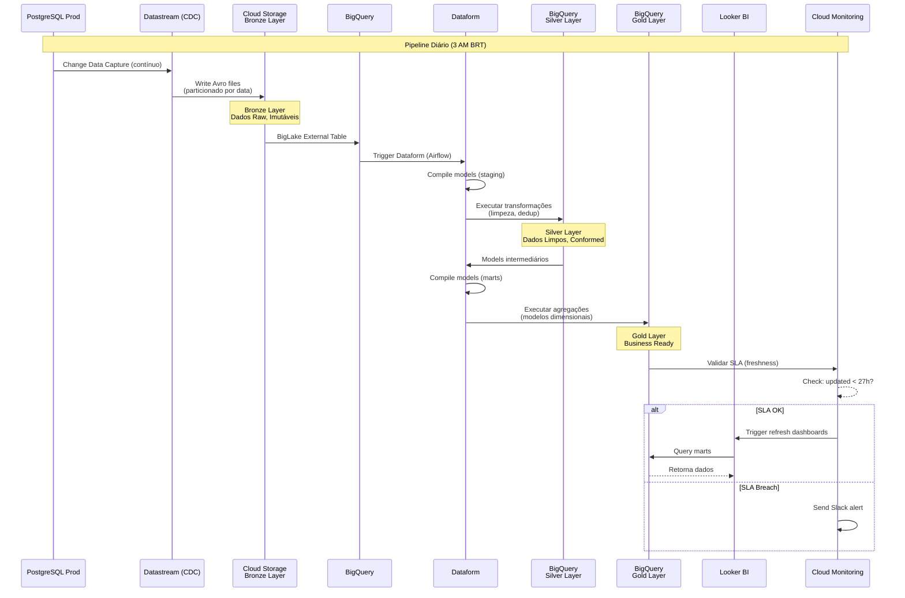
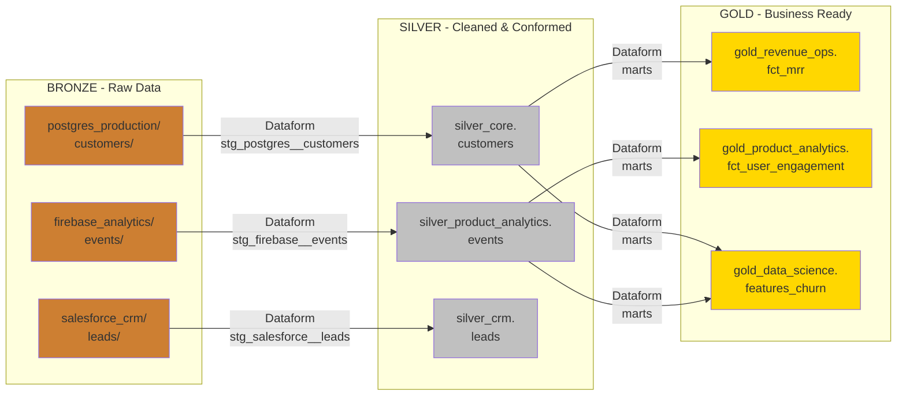
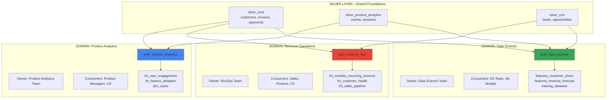
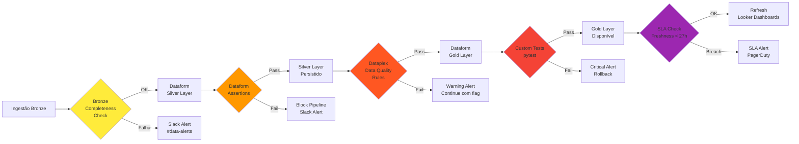
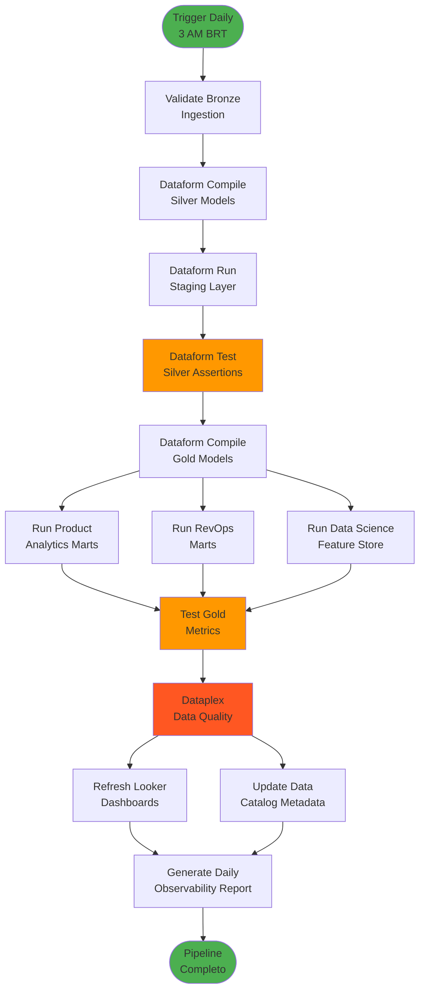
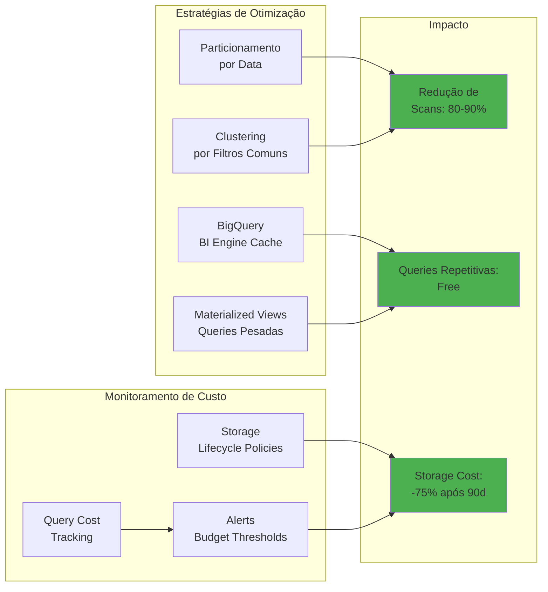
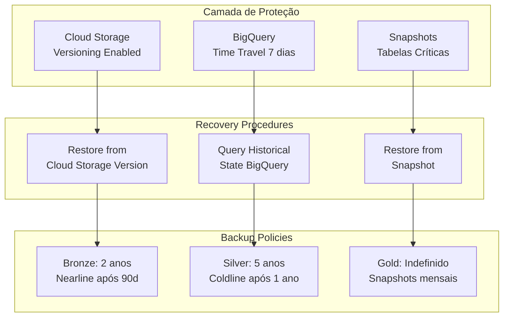
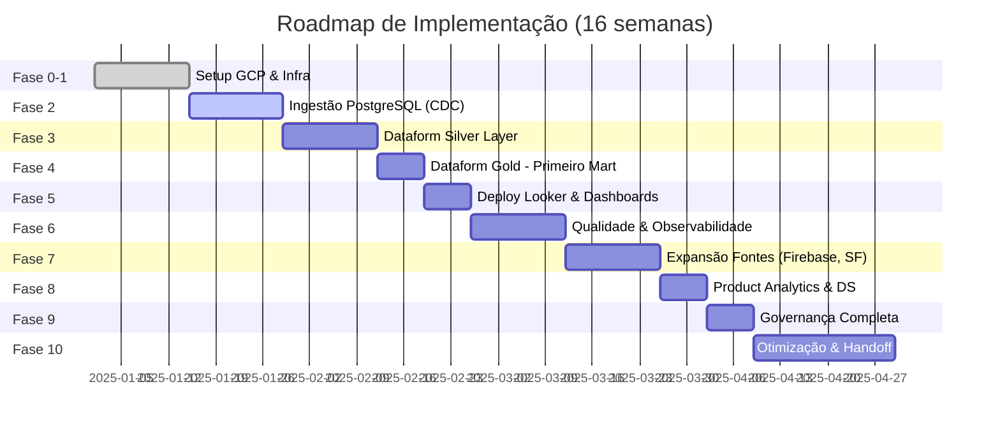

# Diagrama de Arquitetura Detalhado

## Visão Geral - High Level



## Fluxo de Dados Detalhado



## Arquitetura de Camadas (Medallion)



## Data Mesh - Domínios de Negócio



## Pipeline de Qualidade de Dados



## Orquestração - Airflow DAG



## Segurança e Governança

```mermaid
graph TB
    subgraph "IAM & Access Control"
        I1[Service Accounts<br/>dataform@, airflow@]
        I2[Groups<br/>revops-analysts@<br/>data-science@]
        I3[Row-Level Security<br/>BigQuery Policies]
    end

    subgraph "Data Classification"
        C1[Dataplex Taxonomy]
        C2[Policy Tags<br/>PII, Sensitive]
        C3[DLP Scanning<br/>Auto-detection]
    end

    subgraph "Audit & Compliance"
        A1[Cloud Audit Logs<br/>Quem acessou o quê?]
        A2[BigQuery Query Logs<br/>Histórico de queries]
        A3[Data Lineage<br/>Origem → Destino]
    end

    subgraph "Data Catalog"
        D1[Metadados Técnicos<br/>Schema, Types]
        D2[Metadados de Negócio<br/>Descrições, Owners]
        D3[Search & Discovery<br/>Self-Service]
    end

    I2 --> I3
    C1 --> C2
    C2 --> I3
    C3 --> C2

    I1 --> A1
    I2 --> A1
    I3 --> A2
    A2 --> A3

    D1 --> D3
    D2 --> D3
    A3 --> D3
```

## Custo e Performance - Otimização



## Disaster Recovery & Backup



## Roadmap Visual



---

## Notas de Arquitetura

### Decisões Arquiteturais

**1. Por que Dataform ao invés de dbt Core?**
- Gerenciado pelo Google (zero ops)
- Integração nativa com BigQuery e IAM
- Git built-in
- Custo zero (incluído no BigQuery)
- Trade-off: Ecossistema menor (mas conceitos compatíveis com dbt)

**2. Por que Cloud Storage + BigQuery ao invés de só BigQuery?**
- Custo: Storage no GCS é 10x mais barato que BigQuery
- Flexibilidade: Dados raw disponíveis para reprocessamento
- Auditoria: Bronze imutável (compliance)
- BigLake: Query direto do GCS sem cópia

**3. Por que Fivetran e não só Airbyte?**
- Fivetran: SaaS conectores (zero manutenção) para fontes críticas
- Airbyte: Open-source para fontes customizadas e controle de custo
- Híbrido: Melhor custo-benefício

**4. Por que Cloud Composer (Airflow) e não Cloud Workflows?**
- Airflow: Padrão da indústria, comunidade enorme
- Python: Flexibilidade total para lógica complexa
- Histórico: Melhor observabilidade e retry logic
- Trade-off: Mais caro ($200/mês vs $20/mês Workflows)

### Princípios de Design

1. **Idempotência**: Pipelines podem ser re-executados sem efeitos colaterais
2. **Imutabilidade**: Bronze layer nunca é modificado
3. **Incremental-First**: Processar apenas dados novos (custo e performance)
4. **Testing in Production**: Deploy com feature flags, rollback fácil
5. **Documentation as Code**: Metadados versionados junto com código

### Anti-Patterns Evitados

- ❌ Transformações no Bronze (manter raw)
- ❌ Joins no Silver (deixar para Gold)
- ❌ Código não versionado (tudo no Git)
- ❌ Queries sem particionamento (custo alto)
- ❌ Dashboards consultando Bronze/Silver (usar Gold)
